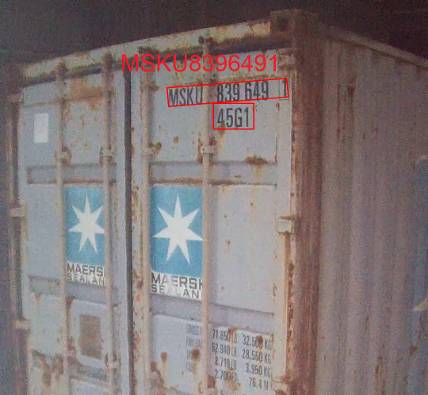

# container_ocr

- This project use DBNet to detect text and SVTR to recognize text and K-means to cluster text.
- The simplest way to run this project is to use the docker image. 
- You can build the image following the instructions in the Dockerfile.
- Currently, the project infer on GPU and requires CUDA >= 11.7.
- I only test recognition on video.
- The inference speed is about 25FPS on a single RTX 2080Ti with frame size: 1280x720.
- Especially, You must put pretrained model and put in the folder `./assets/weights` 
and video sample in the folder `./assets/images` before running the project.
- To run this project, you can use the following command:

    ```docker build -t container_ocr .```

    ```export DISPLAY="IP_HOST:0.0"```, replace IP_HOST with your IP address.

    ```xhost +```

    ```docker run -it --rm --runtime=nvidia --gpus all -v /path/to/your/project/assets:/workspace/assets -e DISPLAY=$DISPLAY container_ocr bash```

    ```mkdir build && cd build```

    ```cmake ..```

    ```make -j8```

    ```./container_ocr ../assets/images/sample.mp4```

- This project is not developed for production, so it is not optimized for speed.
- This project can only run on Libtorch and Torchvision in C++ 17 because of limitation of some operartors. 
Thus, I cannot export to ONNX format and run on TensorRT or OpenVino.
- You can download pretrained model at [here](https://drive.google.com/drive/folders/13x-jakj-GN5v9H8RfmtYHOsrHLFHEWx_?usp=sharing)